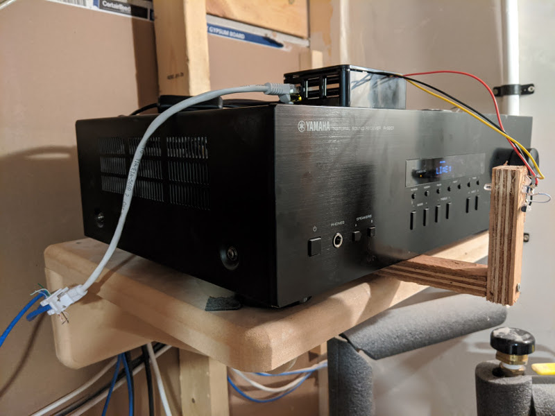
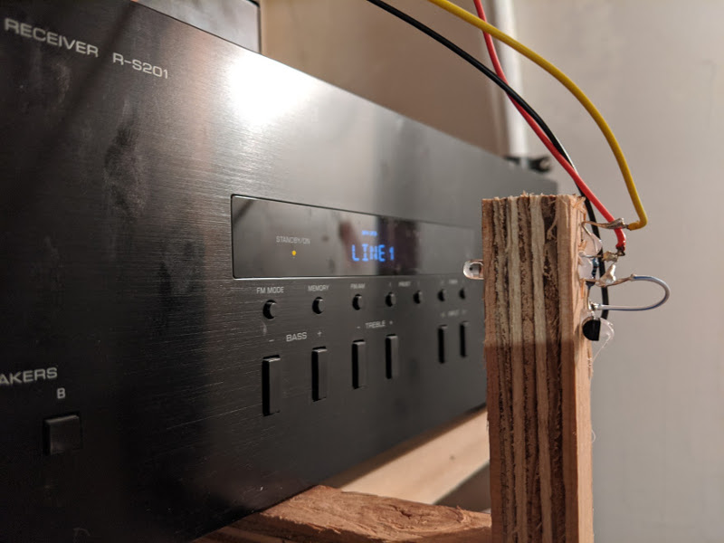

# Infrared controller to turn my audio receiver on 

With a Raspberry Pi hooked up to my Yamaha receiver and [raspotify](https://github.com/dtcooper/raspotify) we can play Spotify through our ceiling speakers. The receiver is in the basement and turns off after a few hours of inactivity which makes sense, most of the time we're not listening to music.

How do I turn it on though when we do want to listen to music? Go down to the basement every time seemed suboptimal. I didn't want to open the receiver and potentially break it with my poor soldering skills. The most straight forward way seemed to be to use IR (infra red) and remote control the receiver that way. So I built a contraption that sits in front of the receiver that "houses" an IR led, a 2N2222 transistor and a 10k Ohm resistor, wired up and controlled by the Raspberry Pi (GPIO) sitting on top of the receiver, hosting raspotify at the same time. I'm not that good with electronics so this is heavily inspired by [this](https://www.raspberry-pi-geek.com/Archive/2015/10/Raspberry-Pi-IR-remote) and [this](https://www.instructables.com/id/Setup-IR-Remote-Control-Using-LIRC-for-the-Raspber/) post. __If you're on Raspbian Buster, make sure you follow the right instructions as LIRC, the IR control library, has changed__. 
I looked up how the transistor worked [here](http://www.learningaboutelectronics.com/Articles/Transistor-switch-circuit.php). 
The best GPIO diagram I could find was [pinoput.xyz](https://pinout.xyz).

All the code really does is send IR commands using `irsend`, see [LIRC](https://www.lirc.org/). There are [tons of profiles](http://lirc.sourceforge.net/remotes/) for all kinds of remote controls out there. I have a _Yamaha RX30_, there was no profile for that one. I tried the _RAX26_ but no luck. So I had to record my own profile. I followed [this](https://www.instructables.com/id/Creating-a-Raspberry-Pi-Universal-Remote-With-LIRC/) tutorial. Beware of step 3, that's not compatible with Raspbian Buster, see above.
To integrate it with existing home automation platforms, I added a simple REST API to trigger the `irsend` call. In the future I'd like to add MQTT as well.
Finally we're installing the API as a `systemd` service.

I use [Home Assistant](https://www.home-assistant.io/) and a REST API can be integrated like this (`configuration.yaml`)

```
rest_command:
  toggle_yamaha_receiver:
    url: 'http://raspberrypi-hosting-the-api.local:5000/rax30/power'
    method: 'post'

script:
  toggle_yamaha_receiver:
    sequence:
      - service: rest_command.toggle_yamaha_receiver
```




## Prerequisites

Requires `virtualenv` and `LIRC`.

## Install dependencies

```
mkvirtualenv ir-receiver-controller
pip install -r requirements.txt
```

## Start application

```
gunicorn -w 2 -b 0.0.0.0:5000 rax30_controller:app
```

## Install as linux service

```
./scripts/build.sh && sudo ./scripts/install.sh
```

## Turn on receiver

`curl -X POST http://localhost:5000/rax30/power`
